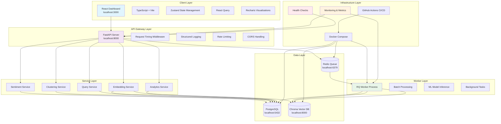
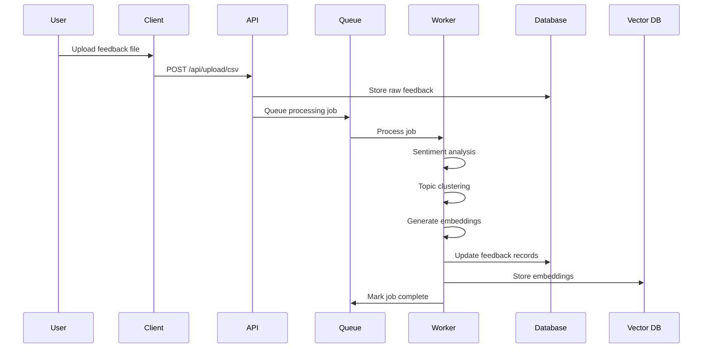
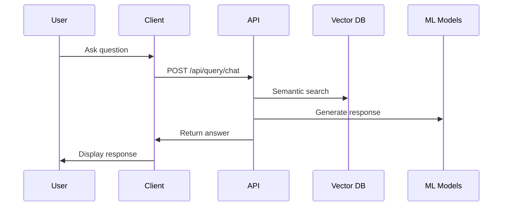

# Architecture Overview

## System Architecture

## Component Details

### Client Layer

**React Dashboard (localhost:3000)**
- **Framework**: React 18 with TypeScript
- **Build Tool**: Vite for fast development
- **State Management**:
  - Zustand for global application state
  - React Query for server state management
- **UI Components**: Recharts for data visualization
- **Styling**: Tailwind CSS
- **Features**:
  - Real-time dashboard with KPIs
  - Interactive charts and graphs
  - Chat interface for Q&A
  - File upload for batch processing

### API Gateway Layer

**FastAPI Server (localhost:8000)**
- **Framework**: FastAPI with automatic OpenAPI docs
- **Middleware Stack**:
  - Request timing and logging
  - Rate limiting
  - CORS handling
  - Structured logging with request IDs
- **Validation**: Pydantic models for all I/O
- **Authentication**: JWT-based auth (future)
- **Monitoring**: Prometheus metrics endpoint

### Service Layer

**Core Services**:
- **SentimentService**: VADER/HuggingFace sentiment analysis
- **ClusteringService**: Topic clustering with HDBSCAN/UMAP
- **EmbeddingService**: Sentence transformers for vectorization
- **QueryService**: Agentic Q&A using vector search
- **AnalyticsService**: KPI calculation and trend analysis

**Architecture Patterns**:
- Dependency injection for testability
- Strategy pattern for ML model selection
- Repository pattern for data access
- Service layer for business logic

### Data Layer

**Databases**:
- **PostgreSQL**: Primary relational database
  - Feedback items and metadata
  - User sessions and auth
  - Topic classifications
  - Audit logs
- **Redis**: Caching and job queues
  - RQ job queue management
  - Session caching
  - Rate limiting data
- **Chroma**: Vector database for embeddings
  - Semantic search indexing
  - Feedback similarity matching

### Worker Layer

**RQ Worker Process**:
- **Job Types**:
  - Feedback batch processing
  - ML model inference
  - Data aggregation jobs
  - Report generation
- **Monitoring**:
  - Job duration histograms
  - Success/failure metrics
  - Active job tracking
- **Error Handling**:
  - Comprehensive logging
  - Automatic retries
  - Dead letter queues

### Infrastructure Layer

**Docker Compose**:
- **Services**: postgres, redis, chroma, server, worker, client
- **Networking**: Isolated networks for security
- **Volumes**: Persistent data storage
- **Health Checks**: Automatic service monitoring

**CI/CD Pipeline**:
- **GitHub Actions**: Automated testing and deployment
- **Coverage**: 80%+ test coverage requirement
- **Linting**: Code quality enforcement
- **Security**: Dependency vulnerability scanning

## Data Flow

### Feedback Processing Pipeline

### Query Processing Flow

## Security Architecture

### Authentication & Authorization
- JWT-based authentication (planned)
- Role-based access control
- API key management for external integrations

### Data Protection
- Input validation and sanitization
- SQL injection prevention
- XSS protection in client
- Secure environment variable handling

### Network Security
- Docker network isolation
- CORS policy enforcement
- Rate limiting middleware
- Request size limits

## Monitoring & Observability

### Metrics
- **HTTP Metrics**: Request counts, duration, error rates
- **Business Metrics**: Feedback processed, user engagement
- **System Metrics**: CPU, memory, disk usage
- **Worker Metrics**: Job success rates, processing times

### Logging
- **Structured JSON logs** with request tracing
- **Request IDs** for distributed tracing
- **Log levels**: DEBUG, INFO, WARNING, ERROR
- **Log aggregation**: File rotation and retention

### Health Checks
- **Application health**: /health endpoint
- **Database connectivity**: /healthz endpoint
- **Dependency checks**: External service availability
- **Metrics endpoint**: /metrics (development only)

## Deployment Architecture

### Development Environment
- Local Docker Compose setup
- Hot reloading for development
- Debug logging enabled
- Metrics endpoint exposed

### Production Environment (Future)
- Kubernetes deployment
- Load balancer configuration
- Horizontal scaling
- Production logging and monitoring
- Database connection pooling
- Redis clustering

## Performance Characteristics

### Scalability
- **Horizontal scaling**: Stateless API servers
- **Queue-based processing**: Async job handling
- **Database optimization**: Connection pooling, indexing
- **Caching strategy**: Redis for session and query caching

### Performance Targets
- **API Response Time**: <500ms for 95th percentile
- **Worker Job Duration**: <30 seconds average
- **Concurrent Users**: 100+ simultaneous connections
- **Feedback Processing**: 1000 items/minute

## Future Enhancements

### Planned Architecture Improvements
- **Microservices decomposition**
- **Event-driven architecture**
- **GraphQL API** for flexible queries
- **Real-time WebSocket connections**
- **Advanced ML model serving**
- **Multi-region deployment**
- **Advanced security features**
